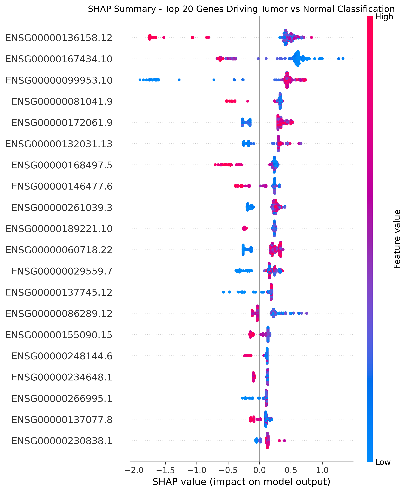
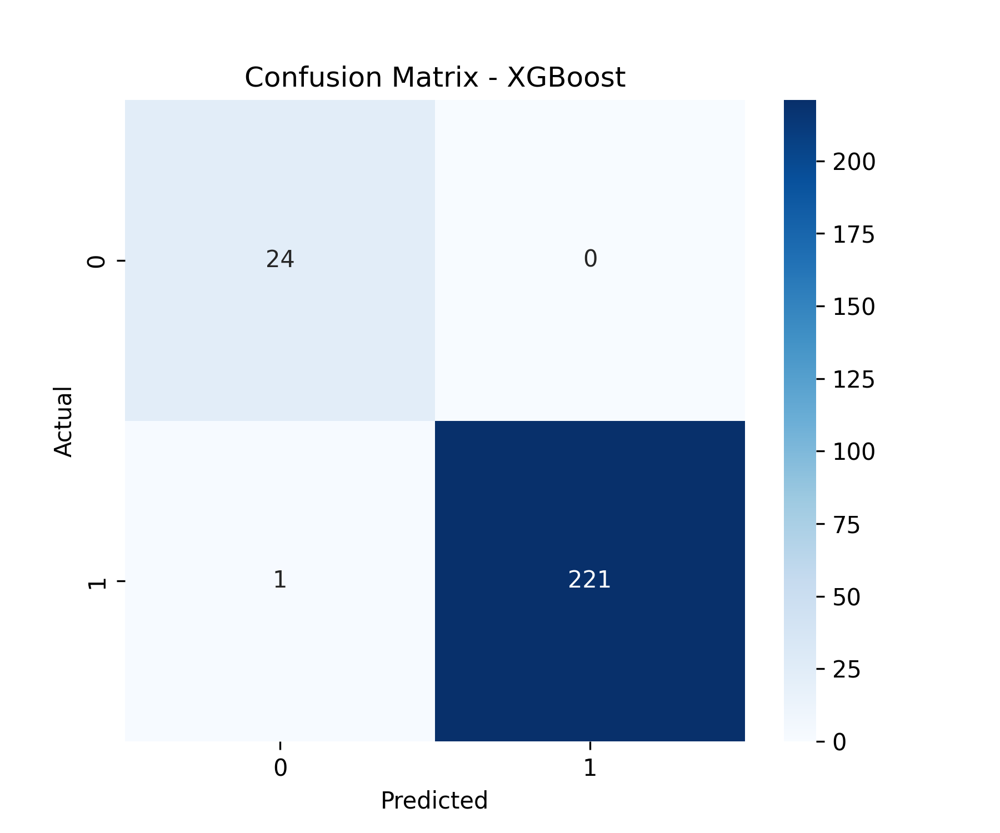
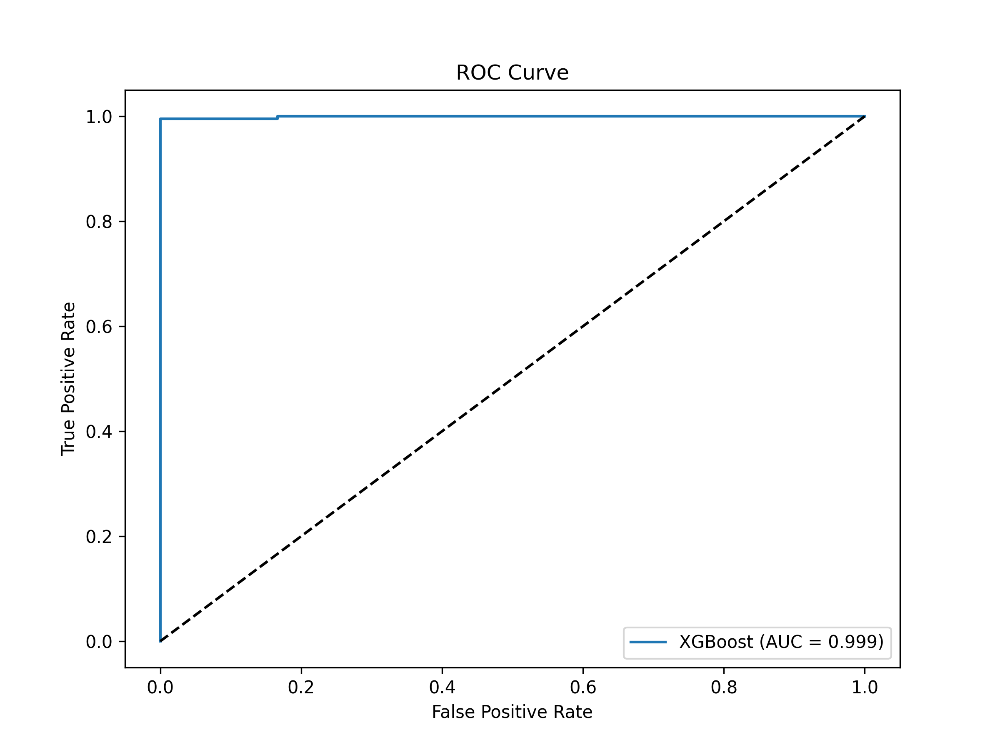

# TCGA-BRCA Cancer Classification with Machine Learning

**End-to-end ML pipeline for classifying Tumor vs Normal samples using real TCGA-BRCA RNA-seq gene expression data.**

## Results

- **Dataset**: TCGA-BRCA (STAR-FPKM-UQ) — 1,226 samples (1,106 Tumor + 120 Normal), 60,660 genes  
- **Features used**: Top 5,000 most variable genes  
- **Best model**: XGBoost

| Model            | Accuracy | ROC-AUC  |
|------------------|----------|----------|
| Random Forest    | 98.37%   | 0.9981   |
| **XGBoost**      | **99.59%** | **0.9992** |

## Visualizations

### SHAP Explainability (Top 20 Genes)


SHAP analysis shows which genes had the strongest impact on the model's decision. Many of these genes are known to be biologically relevant in breast cancer pathways (cell proliferation, DNA repair, etc.).

### Confusion Matrix


Only **1 misclassification** out of 245 test samples.

### ROC Curve


## 🔬 Biological Insight
The model achieves near-perfect classification using only gene expression data. SHAP explainability confirms that the model learned **biologically meaningful patterns** rather than just statistical noise. This is crucial in precision medicine and drug discovery applications.

## 🛠️ Technologies Used
- **Python**
- **Data handling**: pandas, NumPy
- **Machine Learning**: scikit-learn, XGBoost
- **Explainability**: SHAP
- **Visualization**: Matplotlib, Seaborn

## 📥 Dataset
The dataset is publicly available from **UCSC Xena**:
- Gene Expression: TCGA-BRCA STAR-FPKM-UQ
**Download link**:  
[TCGA-BRCA.star_fpkm-uq.tsv.gz](https://xenabrowser.net/datapages/?dataset=TCGA-BRCA.star_fpkm-uq.tsv&host=https%3A%2F%2Fgdc.xenahubs.net)

## How to Run
```bash
# 1. Clone the repo
git clone https://github.com/YOUR-USERNAME/tcga-brca-cancer-classification-ml.git
cd tcga-brca-cancer-classification-ml

# 2. Install dependencies
pip install pandas numpy scikit-learn xgboost shap matplotlib seaborn

# 3. Open the notebook
jupyter notebook tcga_brca_cancer_classification_ml.ipynb
